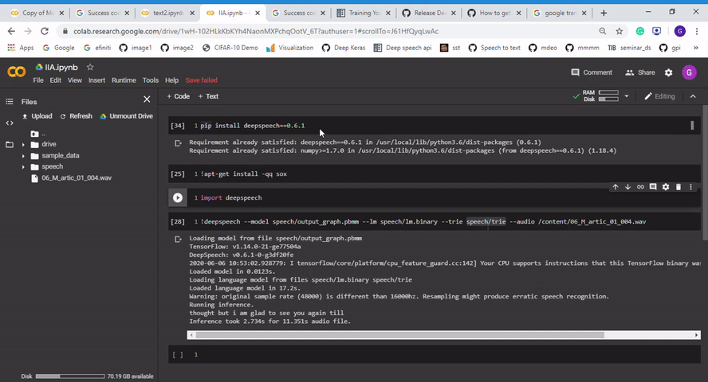
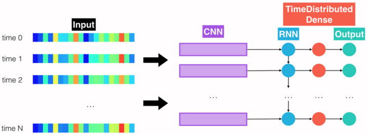
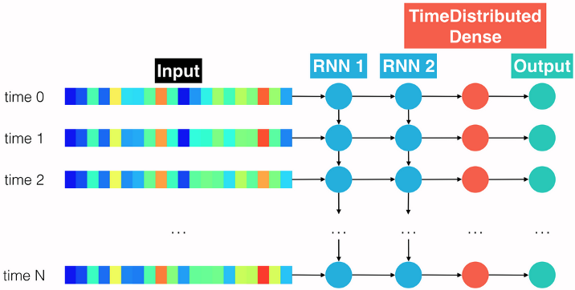
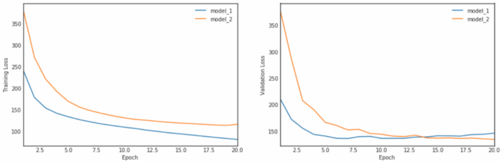
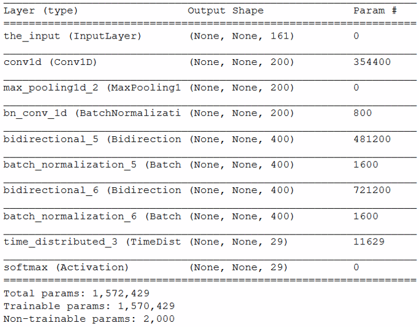
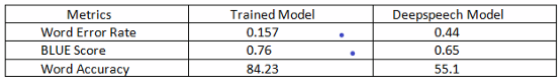
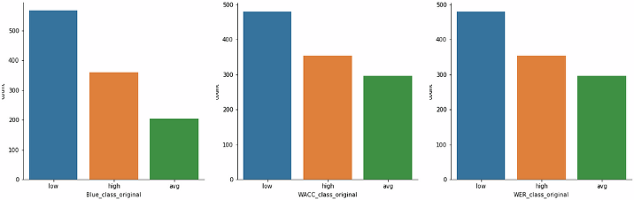
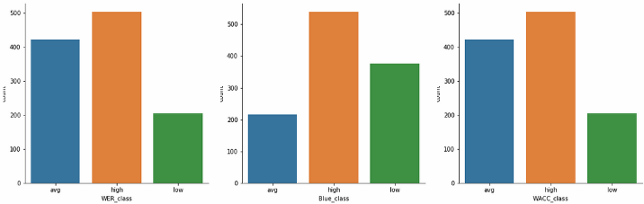

# Indian Accent Speech Recognition
_Traditional ASR (Signal Analysis, MFCC, DTW, HMM & Language Modelling) and DNNs (Custom Models & Baidu DeepSpeech Model) on Indian Accent Speech_

_**<< Uploaded the pre-trained model owing to requests >>**_<br>
_The generated trie file is uploaded to pre-trained-models directory. So you can skip the KenLM Toolkit step._

To understand the context, theory and explanation of this project, head over to my blog:<br>
https://towardsdatascience.com/indian-accent-speech-recognition-2d433eb7edac


# How to Use?

A starter Code to use the model is given in the file: Starter.ipynb. You can run it in your Google Colab, if you upload the 3 files (given in params) to your google drive.

- Install DeepSpeech 0.6.1
- Download the pre-trained model (.pbmm), language model and trie file. 
- Download instructions are given in pre-trained-models folder. After download give them as arguments.

```
!deepspeech --model speech/output_graph.pbmm --lm speech/lm.binary --trie speech/trie --audio /content/06_M_artic_01_004.wav
```




**If you run into issue while loading the pre-trained model, then it is mostly due to your deepspeech version.**


## Contents:

- vui_notebook.ipynb: **DNN Custom Models and Comparative Analysis** to make a custom Speech Recognition model.
- DeepSpeech_Training.ipynb: **Retraining of DeepSpeech Model** with Indian Accent Voice Data.
- Training_Instructions.docx: Instructions to train DeepSpeech model.

## Data Source/ Training Data:

**Indic TTS Project:** Downloaded 50+ GB of Indic TTS voice DB from Speech and Music Technology Lab,  IIT Madras, which comprises of 10000+ spoken sentences from 20+ states (both Male and Female native speakers)

https://www.iitm.ac.in/donlab/tts/index.php

You can also record your own audio or let the ebook reader apps read a document. But I found it is insufficient to train such a heavy model. Then I requested support of IIT Madras, Speech Lab who kindly granted access to their Voice database.

## DNN Custom Models for Speech Recognition:

### Model 1: CNN + RNN + TimeDistributed Dense



### Model 2: Deeper RNN + TimeDistributed Dense



### Comparison: Training Loss & Validation Loss of Model 1 (CNN) & Model 2 (RNN)



### Model 3: Pooled CNN+Deep Bidirectional RNN +Time-distributed Dense




## DeepSpeech Model Training:

These are the high level steps we gonna do:
- Get a **pre-trained model.**
- Load **Indian Accent English Speech dataset**
- **Convert to the input format** to feed the DeepSpeech model.
- Compare trained model with DeepSpeech base model to validate improvement.


## Step by step instructions

- The dataset contains the audio and its description. But to load the data to deep speech model, we need to generate CSV containing audio file path, its transcription and file size.
- **Split the CSV file** into 3 parts: test.csv,train.csv and valid.csv.
- Write a **python program to set the frame rate** for all audio files into 12000hz (deep speech model requirement)
- Clone the **Baidu DeepSpeech Project** 0.6.1 from [here](https://github.com/mozilla/DeepSpeech)
- **Execute DeepSpeech.py** with appropriate parameters (given below).
- Export_dir will contain output_graph.pbmm which you load in deepspeech.model() function.
- **KenLM ToolKit** is used to generate Trie file. It is required to pass in to deep speech decoder function. 
- **model.enableDecoderWithLM(lm_file,trie,0.75,1.85):** lm_file is the .pbmm after training and trie is the output of KenLM Toolkit.
- Use deep speech decoder function to do STT.

```
./DeepSpeech.py --train_files ../data/CV/en/clips/train.csv --dev_files ../data/CV/en/clips/dev.csv --test_files ../data/CV/en/clips/test.csv
```

To fine-tune the entire graph using data in train.csv, dev.csv, and test.csv, for 3 epochs we can tune hyperparameters as below,
```
python3 DeepSpeech.py --n_hidden 2048 --checkpoint_dir path/to/checkpoint/folder --epochs 3 --train_files my-train.csv --dev_files my-dev.csv --test_files my_dev.csv --learning_rate 0.0001
```

**Hyperparameters for Training:**

```
python -u DeepSpeech.py \
   --train_files /home/prem/ds_project/datavoice/data_voice_train.csv \
   --test_files /home/prem/ds_project/datavoice/data_voice_test.csv \
   --dev_files /home/prem/ds_project/datavoice/data_voice_dev.csv \
   --n_hidden 2048 \
   --epoch 100 \
   --use_seq_length False \
   --checkpoint_dir /home/prem/ds_project/datavoice/checkpoints/ \
   --learning_rate 0.0001 \
   --export_dir /home/prem/ds_project/datavoice/model_export/ \
   --train_batch_size 64 \
   --test_batch_size 32 \
   --dev_batch_size 32 \
```


## Comparing Indian Accent English Model with Deepspeech model
To check accuracy, we used **3 metrics: WER, WACC and BLUE SCORE.**



Metric shows trained model **performs much better for Indian Accent English.**

## Model Comparison Results:

Lets plot above metrics, feeding Indian Accent Speech Data (Test Set) to both DeepSpeech pre-trained model and our trained model to compare. The **3 bins in graphs below represents low, medium and high accuracy, from left to right.**

### DeepSpeech Base Model: Most datapoints classified as "Low Accuracy" in all 3 metrics


### Trained Model: Most datapoints classified as "Medium & High Accuracy" in all 3 metrics


The above depiction proves that the **trained model performs much better for Indian Accent Speech Recognition** compared to DeepSpeech model.


## Conclusion

'Cepstral Analysis' separate out the accent components in speech signals, while doing Feature Extraction (MFCC) in Traditional ASR. In state-of-the-art Deep Neural Networks, features are intrinsically learnt. Hence, we can transfer learn a pre-trained model with mutiple accents, to let the model learn the accent peculiarities on its own.<br>

We have proved the case, by doing transfer learning Baidu's DeepSpeech pre-trained model on Indian-English Speech data from multiple states. You can easily extend the approach for any root language or locale accent as well.<br> 

If you have any query or suggestion, you can reach me here.
https://www.linkedin.com/in/ananduthaman/


## References
[1] https://www.iitm.ac.in/donlab/tts/database.php<br>
[2] https://www.udacity.com/course/natural-language-processing-nanodegree--nd892